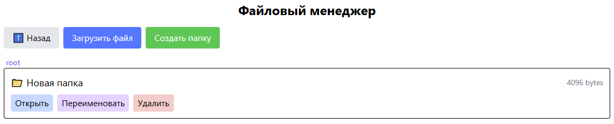

# Файловый менеджер в браузере

Приложение для управления файлами с поддержкой загрузки, скачивания, создания папок и переименования файлов.  



## Возможности

- Просмотр содержимого папок  
- Загрузка файлов  
- Создание новых папок  
- Скачивание файлов  
- Переименование файлов и папок  
- Удаление файлов и папок   
- Docker-контейнеризация  

## Стек технологий

- **Frontend:** SvelteKit, TailwindCSS  
- **Backend:** Node.js (через API для работы с файловой системой)  
- **Упаковка:** Docker  

## Быстрый старт с Docker

Собрать и запустить приложение можно командой:

```bash
# Сборка Docker образа
docker build -t file-manager-svelte .

# Запуск контейнера
docker run -p 5173:5173 file-manager-svelte
